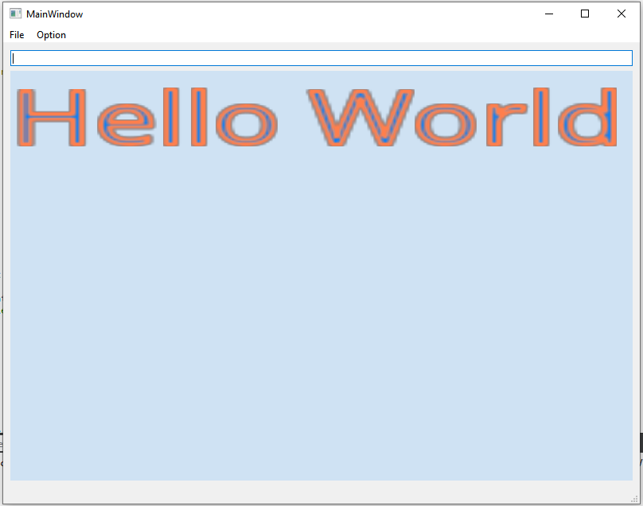

# GLFont
GLFont is a small font rendering application using FreeType and Qt. It creates an altas texture and renders fonts in a single draw call. 

### Functionality
- It loads different fonts and show in the OpenGL Window
- Outline can be enabled

### Dependencies
Qt 5 https://www.qt.io/

FreeType 2 http://freetype.org/

GLM https://glm.g-truc.net/0.9.9/index.html 

### Installation
Build from the CMAKE file

